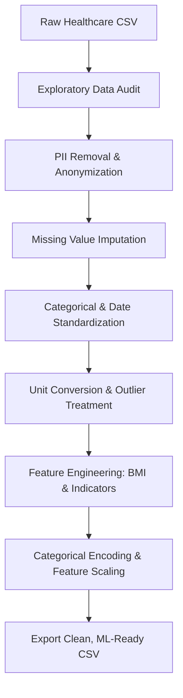

# 🏥 Healthcare Data Cleaning & Quality Assessment
> **Part of the Healthcare Data Analytics Portfolio**  
> *Transforming messy, non-compliant clinical data into clean, privacy-preserved, ML-ready datasets.*


---

## 📌 Table of Contents
- [Project Overview](#-project-overview)
- [Key Objectives](#-key-objectives)
- [Dataset Architecture](#-dataset-architecture)
- [Data Privacy & HIPAA Compliance](#-data-privacy-and-compliance)
- [Data Processing Workflow](#-data-processing-workflow)
- [Before vs. After Comparison](#-results--impact)
- [Repository Structure](#-project-structure)
- [How to Run](#-how-to-run)
- [Author](#%E2%80%8D-author)
---

## 📖 Project Overview

Healthcare data in real-world clinical environments is notoriously dirty—suffering from inconsistent data entry, mixed measurement systems, duplicate records, missing clinical codes, and embedded **Personally Identifiable Information (PII)**. 

This repository details an end-to-end healthcare data preprocessing and quality assessment pipeline written in **Python (Pandas/NumPy)**. The pipeline ingests raw, messy patient data and produces an anonymized, standardized, and machine-learning-ready dataset optimized for clinical prediction models.

> ⚠️ **Disclaimer:** The dataset used is a synthetic healthcare dataset sourced from the *Coursera Healthcare Data Analytics Lab*. It contains no real patient health information (PHI/PII) and is intended solely for educational and analytical demonstration.

---

## 🎯 Key Objectives

* **Data Quality Audit:** Identify, quantify, and document clinical data anomalies (missing values, typos, duplicate visits, unit mismatches).
* **Privacy Preservation:** Strip PII attributes (`Patient_Name`, `EmailID`) to align with healthcare privacy standards (HIPAA/GDPR compliance frameworks).
* **Clinical Unit Standardization:** Unify mixed measurement systems (e.g., converting mixed `lbs` and `kg` values into standardized `kg`).
* **Feature Engineering:** Derive actionable clinical indicators such as **Body Mass Index (BMI)** from raw height and weight.
* **ML Readiness:** One-hot encode categorical features and scale numeric variables for downstream modeling.

---

## 📂 Dataset Architecture

| Attribute | Specification |
| :--- | :--- |
| **Source** | Coursera Healthcare Data Analytics Lab |
| **Record Count** | 200 Synthetic Patient Records |
| **Format** | Tabular CSV |
| **Domain** | Healthcare Operations & Clinical Risk |

### Initial Data Schema & Quality Issues

| Field Name | Data Type | Identified Issues / Preprocessing Goal |
| :--- | :--- | :--- |
| `Patient_ID` | String | Unique Identifier (Kept) |
| `Patient_Name` | String | **PII** ❌ (Removed for Privacy) |
| `EmailID` | String | **PII** ❌ (Removed for Privacy) |
| `Age` | Integer | Missing values & unrealistic outliers |
| `Gender` | Categorical | Inconsistent entries (`M`, `Male`, `F`, `Female`) |
| `Ethnicity` | Categorical | Standardized categories |
| `Weight` | Mixed | Mixed units (`lbs` vs. `kg`) |
| `Height_cm` | Float | Used alongside weight for BMI calculation |
| `Diagnosis_Date` | Date | Mixed formats (`YYYY-MM-DD` and `DD/MM/YYYY`) |
| `Diagnosis_Code` | Categorical | Typos (`ANXITY` instead of `ANX`) & missing values |
| `Glucose_mg_dL` | Numeric | Missing clinical values |
| `Risk` | Binary | Target Variable (`0` or `1`) |

---

## 🔒 Data Privacy and Compliance

Prior to statistical analysis or model training, healthcare data pipelines must strictly enforce privacy guards.  

    [ Raw Dataset ] ──► [ PII Inspection ] ──► [ Drop Name & Email ] ──► [ De-identified Dataset ]
* **Stripped Fields:** `Patient_Name`, `EmailID`
* **Result:** Minimizes risk of patient re-identification while preserving the statistical utility of demographic and clinical metrics.

---

## 🔄 Data Processing Workflow


## 📊 Results & Impact
 
### Before vs. After Preprocessing
 
| 📌 Metric / Dimension | 🔴 Raw Dataset (Before) | 🟢 Processed Dataset (After) |
|----------------------|-------------------------|-----------------------------|
| Privacy Compliance | Exposed PII (`Name`, `Email`) | ✅ 100% De-identified |
| Categorical Consistency | Mixed (`M`, `Male`, `F`, `Female`) | ✅ Standardized (`Male`, `Female`) |
| Measurement Units | Mixed (`kg`, `lbs`) | ✅ Standardized Metric System (`kg`) |
| Clinical Diagnostics | Typos present (`ANXITY`) | ✅ Normalized Codes (`ANX`) |
| Date Formats | Unparsed / Mixed Strings | ✅ ISO-8601 (`YYYY-MM-DD`) |
| Derived Metrics | None | ✅ Calculated BMI & Risk Flags |
| Machine Learning Ready | ❌ Strings, NaNs, Raw Scale | ✅ Encoded, Scaled, Clean |  


## 📂 Project Structure
 
```text
healthcare-data-cleaning/
├── data/
│ ├── raw_data.csv # Original messy dataset
│ └── cleaned_data.csv # Processed, ML-ready output
├── notebook/
│ └── healthcare_data_cleaning.ipynb # Step-by-step Jupyter Notebook
├── outputs/
│ ├── data_quality_report.xlsx # Data audit breakdown
│ └── visualizations/ # Distribution & anomaly plots
├── README.md # Documentation
└── requirements.txt # Dependencies
```
## 🚀 How to Run
 
### 1️⃣ Clone the Repository
 
```bash
git clone https://github.com/your-username/healthcare-data-cleaning.git
cd healthcare-data-cleaning
```
 
### 2️⃣ Create a Virtual Environment & Install Dependencies
 
```bash
python -m venv venv
 
# macOS / Linux
source venv/bin/activate
 
# Windows
venv\Scripts\activate
 
pip install -r requirements.txt
```
 
### 3️⃣ Launch the Jupyter Notebook
 
```bash
jupyter notebook notebook/healthcare_data_cleaning.ipynb
```
 
### 4️⃣ Review Outputs
 
After execution, the project generates:
 
```text
outputs/
├── data_quality_report.xlsx # Data quality assessment report
└── visualizations/ # Charts, distributions, and anomaly plots
```
## 👨‍💻 Author
### Molla Adugna
  **Lead Clinical Anesthetist & Data Analyst** 
    
  Driven by a passion for connecting clinical expertise with data science, transforming complex healthcare data into actionable insights.  
  

    

    
⭐ If you find this project helpful, please consider giving it a star!  


    
## 🌐 Connect With Me
 
[](https://mollaadugna.wixsite.com/molla-adugna-1)
 
[](https://www.linkedin.com/in/molla-adunga/)
[](https://www.fiverr.com/molla_adugna?public_mode=true)

